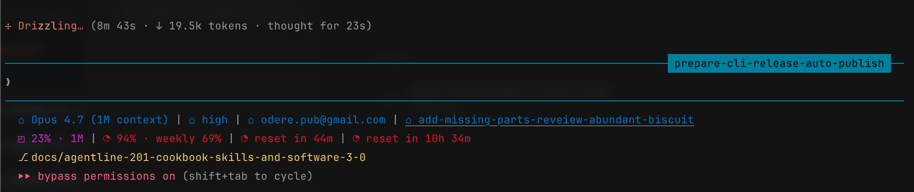

# agentline

_A powerline statusline for Claude Code — git, tokens, context window, rate limits, and a live TUI editor._

**[Website](https://odere-pro.github.io/claude-agentline/)** · **[npm](https://www.npmjs.com/package/@odere-pro/agentline)** · **[Docs](./docs/get-started.md)**

[](https://www.npmjs.com/package/@odere-pro/agentline)
[](https://docs.anthropic.com/claude/docs/claude-code)
[](#use)
[](https://nodejs.org/)
[](./CHANGELOG.md)
[](./LICENSE)
[](https://github.com/odere-pro/claude-agentline/actions/workflows/gates.yml)
[](https://github.com/odere-pro/claude-agentline/actions/workflows/install-matrix.yml)
[](https://scorecard.dev/viewer/?uri=github.com/odere-pro/claude-agentline)
[](https://www.bestpractices.dev/projects/12995)

A fast, themeable statusline for Claude Code. Reads the stdin payload Claude Code's statusline contract sends, writes an ANSI-styled line, exits. No network. No native modules. No plugin scaffolding.

> **Built for Software 3.0.** Agentline is shaped so an LLM agent — not just a human — can install, configure, theme, and troubleshoot it through natural language. The stable stdin contract, the flat scriptable CLI, the seeded subagent skill files, and the per-group `CLAUDE.md` briefings are one coherent design choice, not a feature list. See [SOFTWARE-3-0.md](./SOFTWARE-3-0.md) for the thesis, the dual-audience surface map, and a worked example.

---

## Get started

```bash
npm install -g @odere-pro/agentline   # 1. install the CLI
agentline install                     # 2. wire into Claude Code (statusLine + skills + themes)
agentline reset                       # 2. rewire into Claude Code (statusLine + skills + themes)
agentline doctor                      # 3. verify the wiring
agentline edit                        # 4. customise widgets, theme, and layout (TUI)
```

Restart Claude Code after `reset` — the statusline appears at the bottom of the prompt. Later config changes apply on the next render, no restart needed.



---

## Highlights

**39 widgets across 6 families**, each covering one slice of session status:

| Family        | What it shows                                                      |
| ------------- | ------------------------------------------------------------------ |
| `session`     | model, version, thinking, plan, cwd, agent, account, duration      |
| `tokens`      | input / output token counts, throughput, and host cost scalars     |
| `context`     | context-window usage %, the 200k flag, and cached tokens           |
| `rate-limits` | session & weekly usage, plus one reset-timer (countdown + at-time) |
| `git`         | project, branch, worktree, change counts, upstream, PR             |
| `other`       | clock, added-dirs, output-style, vim-mode                          |

- **Agent-friendly** — `install` adds five agentline skills to your Claude Code session, so you can install, configure, theme, troubleshoot, and update agentline by asking the agent — without leaving Claude Code.
- **Comfortable, intuitive TUI** — `agentline edit` opens a live-preview editor with a widget picker.
- **Search to your widget** — press `/` in the picker for a flat, searchable list across every widget.
- **Previews, grouped by colour & family** — every widget shows a live preview in the picker, colour-coded and grouped by family so the statusline is faster to read at a glance.
- **Plan-link widget** — the `plan` widget links to the plan generated in your Claude Code session, so you never lose it when you clear or compact context.
- **One global config** — a single source of truth at `${CLAUDE_CONFIG_DIR:-~/.config}/agentline/config.json`; no per-project config to drift.
- **Reversible** — `agentline uninstall` restores your previous `statusLine` byte-for-byte and removes the installed skills (`--purge` also wipes user config and custom themes).
- **Powerline-ready** — arrayed chevrons & caps that cycle per line.
- **Theme engine** — graceful truecolor → 256-colour → 16-colour degradation.
- **Self-repairing** — `agentline doctor --fix` auto-repairs settings wiring, config defaults, and missing themes.
- **Zero render-time I/O** — themes and the widget registry are embedded; no network on the hot path.

---

## Use

The CLI is intentionally small: `start` · `reset` · `uninstall` · `doctor` · `edit` · `config`.

### Install and first-time setup

```bash
# From source (today)
git clone https://github.com/odere-pro/claude-agentline && cd claude-agentline
corepack enable && pnpm install && pnpm run build
node dist/cli.mjs reset --from-source

# From npm (when published)
npm install -g @odere-pro/agentline
agentline reset
```

**`reset` is the canonical setup verb** — it wires `statusLine` into Claude Code's settings,
seeds `agentline/config.json` under `$CLAUDE_CONFIG_DIR`, copies shipped themes, and installs
five `agentline*.md` skills. It also performs first-time wiring on a fresh host, making it
safe to run whether agentline is new or already set up. The lower-level `agentline install`
verb is still available (it preserves an existing user config rather than reseeding it) but
is hidden from `agentline help` — `reset` is the entry point for users and agents alike.

Backs up any prior `statusLine` so `uninstall` restores it byte-for-byte.

Restart Claude Code — the statusline appears at the bottom of the prompt.

### Upgrade

After publishing/installing a new version, adopt it with the config you already have:

```bash
npm i -g @odere-pro/agentline@latest   # pull the new version
agentline start                        # rewire to it + preview; your config is preserved
```

`start` is the visible, config-preserving verb: it re-wires `statusLine` to the installed
binary and prints a one-shot preview. Unlike `reset`, it never overwrites `config.json`.

### Configure

Three equivalent paths — pick whichever fits the moment:

| Path                             | When                                                             |
| -------------------------------- | ---------------------------------------------------------------- |
| _"swap the theme to X"_          | Ask the agent in any Claude Code session                         |
| `agentline edit`                 | Interactive TUI with live preview                                |
| `agentline config widget`        | Scriptable: `add`, `remove`, `move`, `replace`, `set-option`     |
| `agentline config init`          | Seed the user config from a preset (`default`/`minimal`/`power`) |
| `agentline config refresh`       | Get or set the statusline refresh cadence (seconds)              |
| `agentline config undo` / `redo` | Roll the last config change back, or forward again               |

Changes apply on the next prompt render — no restart.

### Uninstall

```bash
agentline uninstall          # restore prior statusLine, remove installed skills
agentline uninstall --purge  # also wipe user config + custom themes
```

### Diagnose

```bash
agentline doctor             # report wiring problems
agentline doctor --fix       # auto-repair settings + config wiring
```

---

## Docs

| Topic            | File                                                 |
| ---------------- | ---------------------------------------------------- |
| Get started      | [docs/get-started.md](./docs/get-started.md)         |
| CLI reference    | [docs/cli.md](./docs/cli.md)                         |
| Install          | [docs/install.md](./docs/install.md)                 |
| Configure        | [docs/config.md](./docs/config.md)                   |
| Widgets (all 22) | [docs/widgets.md](./docs/widgets.md)                 |
| Themes           | [docs/themes.md](./docs/themes.md)                   |
| TUI editor keys  | [docs/keymap.md](./docs/keymap.md)                   |
| Doctor checks    | [docs/doctor.md](./docs/doctor.md)                   |
| Troubleshooting  | [docs/troubleshooting.md](./docs/troubleshooting.md) |
| Architecture     | [docs/architecture.md](./docs/architecture.md)       |
| Glossary         | [docs/GLOSSARY.md](./docs/GLOSSARY.md)               |
| Why this shape   | [SOFTWARE-3-0.md](./SOFTWARE-3-0.md)                 |

---

## Requirements

- Node.js 20 LTS or newer
- macOS, Linux, or Windows (Git Bash / WSL)
- Claude Code run at least once (settings file must exist)

---

## Contribute

Bug reports, widget ideas, theme submissions, and PRs are welcome.

```bash
# Bootstrap (pnpm is pinned via package.json "packageManager")
corepack enable
pnpm install --frozen-lockfile
pnpm run build
bash tests/gates/run-all.sh        # full gate suite

# Iterate
pnpm run test:watch                # unit tests
node dist/cli.mjs install --from-source  # link this checkout to Claude Code
node dist/cli.mjs edit             # exercise the TUI editor

# Sanity check before opening a PR
pnpm run lint && pnpm run typecheck && pnpm test
bash tests/gates/run-all.sh
```

See [CONTRIBUTING.md](./CONTRIBUTING.md) for branch/commit conventions, the 5-step "add a widget" recipe, gate descriptions, and the changelog-fragment workflow. Open issues at [github.com/odere-pro/claude-agentline/issues](https://github.com/odere-pro/claude-agentline/issues); security reports go through [SECURITY.md](./SECURITY.md).

---

## Source layout

Core modules live under `src/`, organised into six groups plus the CLI entry. Each group has a `CLAUDE.md` briefing for any Claude Code session opened in this repo.

| Group           | Purpose                                                                                                                   |
| --------------- | ------------------------------------------------------------------------------------------------------------------------- |
| `src/cli/`      | CLI dispatch entry (`cli.ts`) — every verb lives behind this one file.                                                    |
| `src/core/`     | Stdin parse, schema, i18n (`en-dictionary` + `ids`), shared pure libs.                                                    |
| `src/data/`     | Config, theme, tokens, git, session, on-disk caches (`config`, `theme`, `tokens`, `git`, `session`, `state`).             |
| `src/widgets/`  | Per-family widget folders + `families/` catalogue + plumbing (`cell`, `clock`, `registry`, `render-widget`, `separator`). |
| `src/render/`   | Line composer + Powerline transform (`render`, `powerline`).                                                              |
| `src/tui/`      | Lazy-imported TUI editor: `tui/` shell + `picker`, `preview`, `state`, `keys` siblings.                                   |
| `src/commands/` | Verb implementations (`reset`, `install`, `uninstall`, `doctor`) plus the internal `update-check` cache helper.           |

The render hot path stays `ink`/`react`/`src/tui/`-free (gate-19). See [docs/cookbook/04-architecture.md](./docs/cookbook/04-architecture.md) for the hot-path / cold-path boundary and [SOFTWARE-3-0.md](./SOFTWARE-3-0.md) for the design thesis.

---

<p align="center">
  <a href="https://odere-pro.github.io/claude-agentline/">Landing page</a> · <a href="./LICENSE">MIT</a>
</p>
